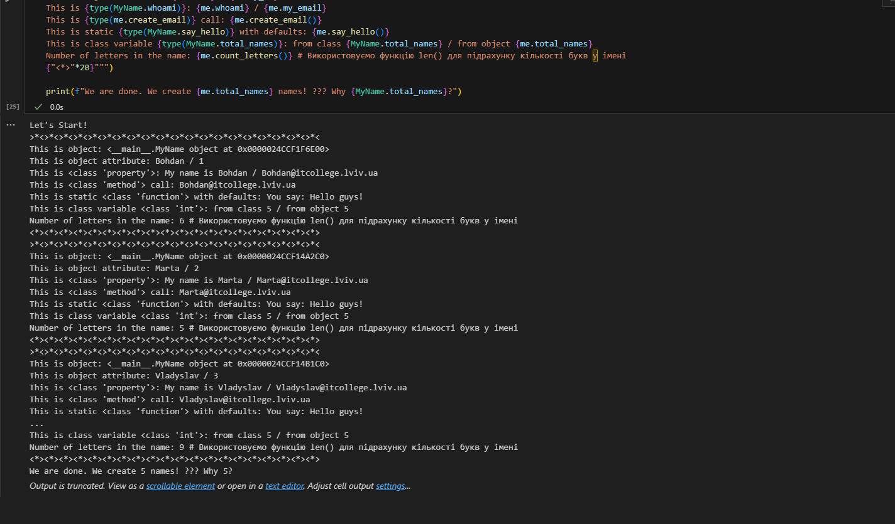

# Звіт до роботи №3
## Тема: _Знайомство з ООП_;
### Мета роботи: _навчитись працювати та створювати класи в Python_;
---
### Виконання роботи
- Результати виконання завдання 1...N;
1. Створили [файли Python Notebook](note.ipynb) де працювали з класами;
2. Розробили клас `WhoHasPets` який симулював клуб любителів домашніх тварин;
3. Всі результати роботи з класом об'єктів представлені [Python Notebook](note.ipynb);
4. Винесли створений клас у модуть та попрактикувались в його імпорті;
5. Скріншот роботи програми


6. Відповіді на запитання:

Чому коли передаємо значення None створюється обєкт з іменем Anonymous?

Для створення об'єкта `MyName` у тому випадку, якщо `name` дорівнює `None`.

Як змінити текст привітання при виклику методу say_hello()? Допишіть цю частину коду.

Щоб це зробити, потрібно дописати в рядку say_hello в лапках відповідний текст привітання. Ось приклад того, як це зробив я:

```
@staticmethod
    def say_hello(message="Hello guys!"): # У даному випадку написав Hello guys!
        """Static method
        """
        return f"You say: {message}"
``````

Допишіть функцію в класі яка порахує кількість букв і імені (підказка: використайте функцію len());

```def count_letters(self):
        """Метод для підрахунку кількості букв у імені
        """
        return len(self.name) if self.name is not None else 0
``````

Порахуйте кількість імен у списку names та порівняйте із виведеним результатом. Дайте відповідь чому маємо різну кількість імен?

Тому що коли ми створюємо анонімний об'єкт MyName за допомогою методу `anonymous_user()`, `total_names` збільшується на 1, навіть якщо ми явно не передамо ім'я.

### Висновок:
>у висновку потрібно відповісти на запитання:

❓ Що зроблено в роботі;

Під час виконання роботи були вивчено основи ООП. Зокрема різні методи та класи.

❓ Чи досягнуто мети роботи;

Мети роботи досягнуто

❓ Які нові знання отримано;

Отримано знання з основ ООП

❓ Чи вдалось відповісти на всі питання задані в ході роботи;

Так

❓ Чи вдалося виконати всі завдання;

Так, вдалося виконати усі завдання

❓ Чи виникли складності у виконанні завдання;

Виникали, але їх вдалось вирішити

❓ Чи подобається такий формат здачі роботи (Feedback);

Так, такий формат здачі робіт подобається

❓ Побажання для покращення (Suggestions);

На даний момент, нажаль нічого запропонувати не можу
